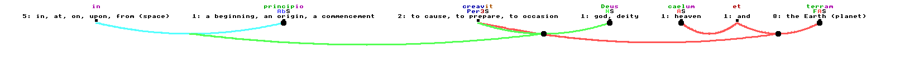

# HolyC Latin
  Welcome the the begining of my HolyC Latin,its based on old code i wrote awhile ago.

  It comes with a dump from the wiktionary in Latin.json.Z. `Visual.HC` is the file you'll want to run, `Dict.HC` will generate  a massive "INDEX.TRIE"(about 700M)index of the Latin.json(uncompressed 1.1G) file.

  Ill talk more later. Just look at the `Latin.GMR` if you want to contriubute. Making `Generator.HC` multicore would be cool too.

# Getting the Latin.json

  Visit 

   Download it here: https://kaikki.org/dictionary/Latin/kaikki.org-dictionary-Latin.jsonl and rename it to Latin.json in your repo

  I also includes a ZIP'ed version of it in `Latin.json.zip`. Ill let you unzip it,I dont wnat this project to be subject to link rot
# Editing the Latin Grammar(Latin.GMR).

  There are 2 Juicy componets of the Latin Grammar,
   - Terminal Symbols(Indiviudal words).
   - Compound Symbols(made of multiple symbols) 

## Terminal Symbols

These are the words.

```
//(Symbol_name) (required_flags) = (result_flags);
Adj@Adj ADJECTIVE = ADJECTIVE;
```

## Compound Symbols
 These make up the parts of the sentences(like phrases)

```	
 Sent CLAUSE -> Noun@Noun !Verb@Verb Noun@Noun;
```
 
 
 **YOU CAN VALIDATE A RULE WITH A HOLYC FUNCTION**
 Sometimes grammar can get messy,so you can write a HolyC function to validate a grammar rule before it is applied,Use `Rule(ValidatEFun)`,example:

```
Sent(NumberAgree) CLAUSE -> Noun@Noun !Verb@Verb;
``` 

 This will call NumberAgree,this would ensure that the Noun@Noun matches the Verb@Verb's number(plural/singualr)  
 
 ## Dynamically adding flags to rules
	
 Use the `[FlagsFunction]` to do this,example,`FlagsPlural` will make the rule plural:

```
 Noun@Noun (CaseAgree)[FlagsPlural] NOUN -> Noun@Noun !Conj@Conj Noun@Noun;
```


## Grammar Sub-Expressions.

  Take this passage for example from the Vulgate:
```
	in principio creavit Deus caelum et  terram
```

  A good parsing would like this: 
  
  It ia possible to do sub expressions in the `Latin.GMR` file,this is the juicy rule
  
```
Sent CLAUSE -> [Prep@Prep Noun@Noun(WHERE)](WHERE)  !Sent; /*[In the begining],God made the earth and sky*/
``` 

**MAKE SURE YOU DEFINED A RULE TYPE AFTER A SUB-EXPRESSION**(Use the parenthesis)

## Rule types
 - NOUN
 - VERB
 - CONJUNCTION
 - OF
 - WHERE
 - ADJECTIVE
 - INFINITIVE
 - MEASURE
 - ADVERB
 - CLAUSE(like a sentence)
 - COMPARE
 - QUESTION 

# Declensions and Conjugations

  Declensions x conjugations are copy and pasted mostly from  wiktionary.
  
  The (c)shell scripts are put in `CSHLatin`,run `tcsh all.tcsh` to generate the `Latin.INFLECTS`,or just use the one provided in this repo. This is opensource software so why not include sources.
  
  I still need inflections of infinitives and greek-latin stuff. Look at all the `*.tcsh` scripts for inspiration

# Credits


.
